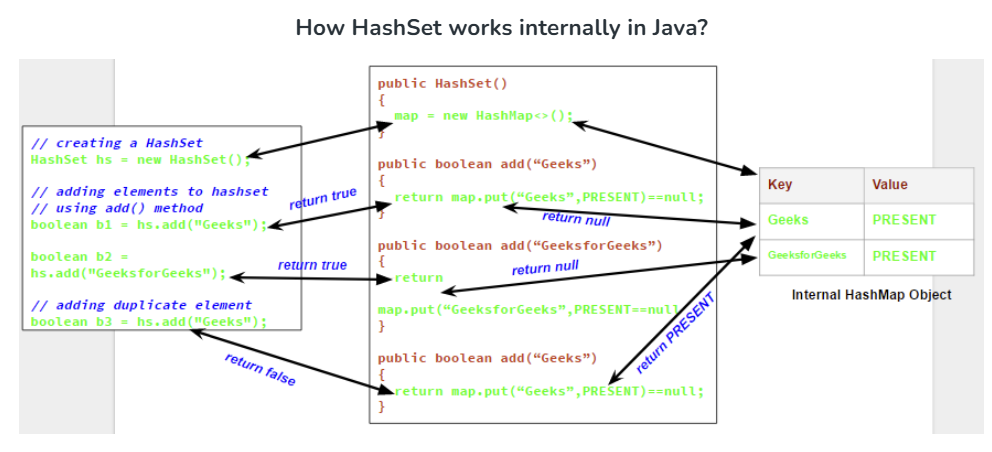

# Collections Core Concepts
-
1. **What is the Java Collections Framework, and why is it used?**  
   - The **Java Collections Framework (JCF)** is a set of classes and interfaces that provides a standard way to store, manipulate, and retrieve groups of objects efficiently.  
   - It helps with **code reusability, performance optimization, and reduced programming effort** by offering predefined data structures and algorithms.  

2. **What are the core interfaces in the Java Collections Framework?**  
   - Collection (superinterface)  
     - `List` (e.g., `ArrayList`, `LinkedList`, `Vector`)  
     - `Set` (e.g., `HashSet`, `TreeSet`, `LinkedHashSet`)  
     - `Queue` (e.g., `PriorityQueue`, `Deque`)  
   - `Map` (e.g., `HashMap`, `TreeMap`, `LinkedHashMap`, `ConcurrentHashMap`)  

3. **What is the difference between Collection and Collections in Java?**  
   
| Feature | **Collection** | **Collections** |
|---------|--------------|----------------|
| **Definition** | Collection is an **interface** in Java that represents a group of objects. | Collections is a **utility class** that provides static methods for working with collections. |
| **Package** | `java.util.Collection` (superinterface for List, Set, Queue). | `java.util.Collections` (utility class for collection manipulation). |
| **Type** | Interface | Class |
| **Usage** | Provides a blueprint for implementing data structures like `List`, `Set`, `Queue`. | Provides helper methods such as sorting, searching, and thread-safety. |
| **Methods** | Contains methods like `add()`, `remove()`, `size()`, `iterator()`. | Contains static utility methods like `sort()`, `reverse()`, `synchronizedList()`, `min()`, `max()`. |
| **Inheritance** | Extended by subinterfaces (`List`, `Set`, `Queue`). | Cannot be extended (final class). |
| **Implementation** | Implemented by classes like `ArrayList`, `HashSet`, `LinkedList`, etc. | Not implemented, only contains static methods. |
| **Thread Safety** | Does not provide synchronization by default. | Provides methods like `synchronizedList()` and `synchronizedMap()` for thread safety. |
| **Sorting Support** | No built-in sorting mechanism. | Provides `Collections.sort()` for sorting lists. |


### **List and Set Implementations**  

4. **What is the difference between `ArrayList` and `LinkedList`? When should you use each?**  
   - **`ArrayList`**
        - It is backed by a **dynamic array** to store the elements.
        - It provides **O(1)** access time but **O(n) insertion/deletion** in the middle.  
        - Manipulation with ArrayList is slow because it internally uses an array. If any element is removed from the array, all the other elements are shifted in memory.
   - **`LinkedList`** 
        - It is a **doubly linked list**, making insertion/deletion **O(1)** but lookup **O(n)**.  
        - Manipulation with LinkedList is faster than ArrayList because it uses a doubly linked list, so no bit shifting is required in memory.
      - **Example:**
         ```java
         List<String> arrayList = new ArrayList<>();
         List<String> linkedList = new LinkedList<>();
         ```

5. **How does `Vector` differ from `ArrayList`?**  
   - **`Vector`** is **synchronized**, making it thread-safe but slower.  
   - **`ArrayList`** is **not synchronized**, making it faster in a single-threaded environment.  

6. **What is the default capacity of an `ArrayList`, and how does it grow dynamically?**  
   - Default capacity is **10**, and when full, it grows by **1.5x the current size**.  

7. **How does `HashSet` ensure uniqueness?**  
   - **`HashSet`** uses **hashing** and relies on `hashCode()` and `equals()` to prevent duplicates.  

       

8. **What is the difference between `HashSet`, `LinkedHashSet`, and `TreeSet`?**  
   - **`HashSet`** - **Unordered** and provides O(1) operations.  
   - **`LinkedHashSet`** - **Maintains insertion order**.  
   - **`TreeSet`** - **Sorted** but has O(log n) complexity due to its Red-Black Tree implementation.  

---

### **Map Implementations**  

9. **How does `HashMap` work internally?**  
   - **`HashMap`** stores key-value pairs in **buckets** based on the `hashCode()` of the key.  
   - Collisions are resolved using **Linked List (Java 7)** or **Tree (Java 8+ when a bucket exceeds 8 nodes).**  

10. **What is the difference between `HashMap` and `Hashtable`?**  
   - **`HashMap`** is **not synchronized** and allows **one null key**.  
   - **`Hashtable`** is **synchronized** and does **not allow null keys or values**.  

11. **What is the difference between `HashMap`, `LinkedHashMap`, and `TreeMap`?**  
   - **`HashMap`** - No ordering guarantee.  
   - **`LinkedHashMap`** - **Maintains insertion order**.  
   - **`TreeMap`** - **Sorted order (based on keys)** and uses a Red-Black Tree.  

12. **What is `ConcurrentHashMap`, and how does it improve performance?**  
   - `ConcurrentHashMap` is a **high-performance, thread-safe implementation** of the `Map` interface that allows **concurrent access** to the map **without locking the entire structure**. It is part of the `java.util.concurrent` package and is a preferred choice in **multi-threaded environments**.

### **Key Characteristics of `ConcurrentHashMap`:**

| Feature | Description |
|--------|-------------|
| **Thread Safety** | Allows safe concurrent read and write operations **without external synchronization**. |
| **Fine-Grained Locking** | Uses **bucket-level locking (Java 7)** or **internal partitioning (Java 8)** to allow multiple threads to operate in parallel. |
| **Locking Strategy (Java 8+)** | Uses **CAS (Compare-And-Swap)** and **synchronized blocks** only when necessary — improving throughput. |
| **Null Support** | **Does not allow `null` keys or values** — avoids ambiguity during concurrent access. |
| **Performance** | Much faster than `Hashtable` and synchronized `HashMap` in concurrent scenarios. |
| **Fail-safe Iterator** | Does **not throw `ConcurrentModificationException`**, but reflects the **state of the map at some point** during iteration. |
| **Use Case** | Ideal for **caches, registries, or real-time metrics** where read/write happens concurrently. |


   ### **Example:**
         ```java
         import java.util.concurrent.ConcurrentHashMap;

         public class ConcurrentMapExample {
            public static void main(String[] args) {
               ConcurrentHashMap<String, Integer> map = new ConcurrentHashMap<>();
               
               map.put("A", 1);
               map.put("B", 2);

               // Safe concurrent access
               map.computeIfAbsent("C", key -> 3);

               System.out.println(map); // Output: {A=1, B=2, C=3}
            }
         }
         ```
### 🔹 **Why Use ConcurrentHashMap Instead of Hashtable or SynchronizedMap?**
| Implementation | Drawback |
|----------------|----------|
| `Hashtable` | Global lock on every operation → **performance bottleneck** |
| `Collections.synchronizedMap()` | Entire map is locked → **not scalable** |
| `ConcurrentHashMap` | Uses fine-grained locks or CAS → **high concurrency support** |


13. **What is `WeakHashMap`, and when should you use it?**  
   - **`WeakHashMap`** stores **keys as WeakReferences**, meaning they will be **garbage collected** if not referenced elsewhere.  

   - **Example:**
      ```java
      WeakHashMap<Object, String> weakMap = new WeakHashMap<>();
      Object key = new Object();
      weakMap.put(key, "Weak Value");
      key = null; // The entry will be eligible for GC
      System.gc();
      ```

---

### **Queues and Deques**  

14. **What is the difference between `Queue` and `Deque`?**  
   - `Queue` - Follows **FIFO** (e.g., `LinkedList`, `PriorityQueue`).  
   - `Deque` - Supports both **FIFO and LIFO** (e.g., `ArrayDeque`).  

15. **How does a `PriorityQueue` work?**  
   - Elements are ordered based on **natural order** or a **custom Comparator**.  

16. **What is the difference between `poll()` and `remove()` in `Queue`?**  
   - `poll()` returns `null` if empty, while `remove()` throws an exception.  

---

### **Concurrency & Performance**  

17. **How do you synchronize a collection in Java?**  
- In Java, synchronizing a collection means making it **thread-safe**, so that **multiple threads can access or modify it safely** without corrupting its state.

   ### ✅ **Synchronization of Collections in Java**

   | **Definition / Explanation** | **Example** | **Notes** |
   |------------------------------|-------------|-----------|
   | **1. Using `Collections.synchronizedXXX()`**<br>Wraps standard collections with synchronized versions to make them thread-safe. | ```java List<String> syncList = Collections.synchronizedList(new ArrayList<>()); Map<String, String> syncMap = Collections.synchronizedMap(new HashMap<>()); ``` | ✅ Easy to use<br>⚠️ Must manually synchronize during iteration: <br>`synchronized(syncList) { for(...) }` |
   | **2. Using Concurrent Collections (Recommended for multi-threading)**<br>Thread-safe, high-performance collections from `java.util.concurrent`. | ```java Map<String, String> map = new ConcurrentHashMap<>(); List<String> list = new CopyOnWriteArrayList<>(); ``` | ✅ Best for high-concurrency apps<br>✅ More scalable than synchronized wrappers<br>❌ Slightly higher memory usage (e.g., `CopyOnWriteArrayList`) |
   | **3. Manual Synchronization Using `synchronized` Block**<br>Manually control thread-safe access to the collection. | ```java List<String> list = new ArrayList<>(); synchronized (list) { list.add("A"); } ``` | ✅ Gives precise control<br>❌ Verbose<br>❌ Error-prone<br>❌ Not recommended for complex or large applications |

18. **What is `CopyOnWriteArrayList`, and when should you use it?**  
   - It creates a new copy of the list on every modification, making it ideal for **read-heavy** scenarios.  

19. **How do you prevent `ConcurrentModificationException` when iterating?**  
   - `ConcurrentModificationException` occurs when a **collection is modified while it is being iterated**, using **fail-fast iterators** like those from `ArrayList`, `HashMap`, etc.

      ### Common Scenario That Causes the Exception
         ```java
         List<String> list = new ArrayList<>(List.of("A", "B", "C"));

         for (String item : list) {
            if (item.equals("B")) {
               list.remove(item); // ❌ throws ConcurrentModificationException
            }
         }
         ```

### ✅ **Ways to Prevent It**

| **Approach / Strategy** | **Example** | **Notes** |
|--------------------------|-------------|-----------|
| **1. Use `Iterator` and `iterator.remove()`**<br>Only safe way to remove elements while iterating. | ```java Iterator<String> it = list.iterator(); while (it.hasNext()) { if (it.next().equals("B")) { it.remove(); } } ``` | ✅ Safe removal<br>❌ Works only for removing elements, not adding |
| **2. Use `CopyOnWriteArrayList` for concurrent modification**<br>Creates a copy of the list on each write operation. | ```java List<String> list = new CopyOnWriteArrayList<>(List.of("A", "B", "C")); for (String item : list) { if (item.equals("B")) list.remove(item); } ``` | ✅ No exception<br>✅ Thread-safe<br>❌ Slower for write-heavy scenarios |
| **3. Collect items to remove, and remove them after the loop**<br>Modify collection only after iteration ends. | ```java List<String> toRemove = new ArrayList<>(); for (String item : list) { if (item.equals("B")) toRemove.add(item); } list.removeAll(toRemove); ``` | ✅ Works for both add/remove<br>❌ More memory overhead |
| **4. Use `ListIterator` when iterating over a list**<br>Supports safe removal and addition. | ```java ListIterator<String> it = list.listIterator(); while (it.hasNext()) { if (it.next().equals("B")) it.remove(); } ``` | ✅ Allows element updates and bidirectional traversal |

### 🔹 Bonus (for Maps): Use `Iterator` on `entrySet()`  
   ```java
   Map<String, String> map = new HashMap<>();
   map.put("A", "1"); map.put("B", "2");

   Iterator<Map.Entry<String, String>> it = map.entrySet().iterator();
   while (it.hasNext()) {
      Map.Entry<String, String> entry = it.next();
      if (entry.getKey().equals("A")) {
         it.remove(); // ✅ Safe
      }
   }
   ```

### **Sorting and Comparators**  

20. **What is the difference between `Comparable` and `Comparator`?**  
   - `Comparable` is for **natural ordering** (`compareTo()` in the class itself).  
   - `Comparator` is for **custom ordering** (`compare()` method).  

   **Example:**
   ```java
   Collections.sort(list, Comparator.comparing(Employee::getSalary));
   ```

21. **How do you sort a `List` of objects using Java 8 Stream API?**  
   ```java
   list.sort(Comparator.comparing(Employee::getName));
   ```

---

### **Use Cases & Best Practices**  

22. **How do you implement an LRU Cache in Java?**  
   - Use `LinkedHashMap` with `accessOrder=true` and override `removeEldestEntry()`.  An LRU (Least Recently Used) cache is a type of cache that evicts the least recently accessed element when the cache is full.
        - [Code](https://github.com/MJubairahamed/JavaLearningCodeRepo/blob/main/Code/CollectionExamples/LeastRecentlyUsedCache.java)

23. **How do you remove duplicates from an `ArrayList`?**  
   - Using Stream 
      -  [Code](https://github.com/MJubairahamed/JavaLearningCodeRepo/blob/main/Code/CollectionExamples/removeduplicatesarraylist/RemoveDuplicatesArrayListUsingStream.java)
   - Using Iterator
      - [Code](https://github.com/MJubairahamed/JavaLearningCodeRepo/blob/main/Code/CollectionExamples/removeduplicatesarraylist/RemoveDuplicatesUsingIterator.java)
   - Using LinkedHashMap
      - [Code](https://github.com/MJubairahamed/JavaLearningCodeRepo/blob/main/Code/CollectionExamples/removeduplicatesarraylist/RemoveDuplicatesUsingLinkedHashMap.java)

24. **How would you count the occurrences of words in a sentence using Java Collections?**  
   - Use `HashMap<String, Integer>` to store word frequencies.  
        -  [Code](https://github.com/MJubairahamed/JavaLearningCodeRepo/blob/main/Code/CollectionExamples/WordCountFromSentence.java)

25. **Which Java collection would you use for a multi-threaded job queue?**  
   - BlockingQueue provides thread-safe operations for adding and retrieving elements, with the added benefit of blocking behavior when the queue is either full or empty. This eliminates the need for manual synchronization and wait/notify mechanisms, simplifying the code and reducing the risk of errors.
   - LinkedBlockingQueue is often preferred due to its flexibility.  Use (`LinkedBlockingQueue` or `ArrayBlockingQueue`).  

26. **Which collection would you use for real-time leaderboard ranking?**  
   - Use `TreeMap` (sorted order) or `PriorityQueue`.  

27. **How do you convert an `Array` to a `List` in Java?**  
      ```java
      List<String> list = Arrays.asList(array);
      ```

28. **How do you merge two unsorted lists and remove duplicates?**  
   - Use `Set` (`HashSet` or `LinkedHashSet`).  

29. **What is `EnumSet`, and when is it used?**  
   - A specialized `Set` for Enums with **high performance** and **bitwise storage**.  
        -  [Code](https://github.com/MJubairahamed/JavaLearningCodeRepo/blob/main/Code/CollectionExamples/EnumSetsExample.java)

30. **What are the best practices for using Java Collections in large-scale applications?**  
   - Use **lazy initialization**, **proper data structures**, and **optimize memory usage**.  


---

### **Difference Between `Collections.sort()` with and without `Comparator`**  

| Feature | `Collections.sort(list)` (Without Comparator) | `Collections.sort(list, Comparator)` (With Comparator) |
|---------|--------------------------------|------------------------------------|
| **Sorting Order** | Natural order (ascending for numbers, lexicographical for Strings). | Custom order (ascending, descending, or based on other properties). |
| **Implementation Requirement** | Class must implement `Comparable<T>` and override `compareTo()`. | No need to modify class; sorting logic is external. |
| **Flexibility** | One sorting logic per class. | Multiple sorting strategies possible. |
| **Best Use Case** | Simple sorting when natural order is sufficient. | Complex sorting scenarios (e.g., sorting by multiple fields). |

- [code](https://github.com/MJubairahamed/JavaLearningCodeRepo/blob/main/Code/CollectionExamples/ComparatorInterfaceExample.java)
---
## Notes:
   - In Java, "non-synchronized" signifies that a method or block of code does not have any built-in mechanism to control concurrent access from multiple threads. When a method is not synchronized, multiple threads can execute it simultaneously, potentially leading to data corruption or inconsistent state if the method accesses shared resources. 
   - on-synchronized methods are faster due to the absence of locking overhead
   - synchronized methods or blocks, which allow only one thread to execute them at a time, ensuring data consistency.