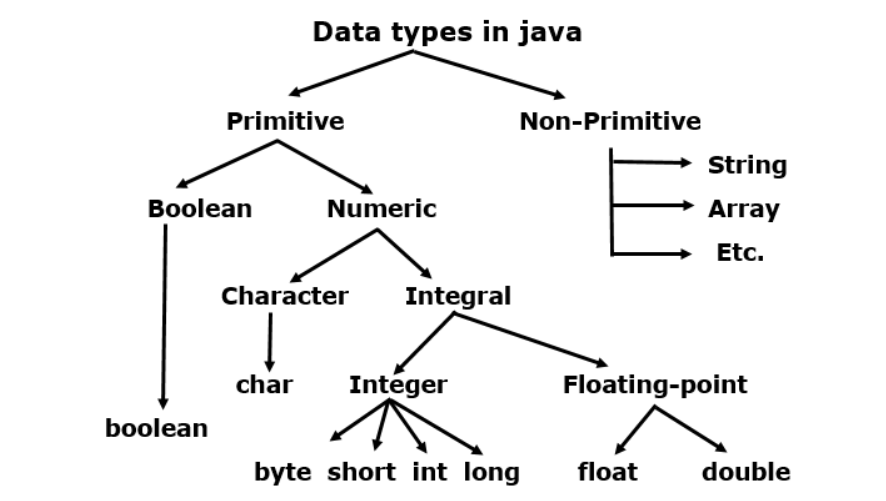

<h1 style="text-align: center;">Data Types & Variables</h1>
--

## Data Types
### Basic Data Types in Java: 
- There are two types of data types in Java: 
    * Primitive data types. 
    * Non-primitive data types. 


### Java primitive data types with their types, size, range, and default values:

| **Type**  | **Size**       | **Range**                                                               | **Default Value** |
|-----------|----------------|-------------------------------------------------------------------------|-------------------|
| `byte`    | 1 byte (8 bits) | -128 to 127                                                             | 0                 |
| `short`   | 2 bytes (16 bits) | -32,768 to 32,767                                                       | 0                 |
| `int`     | 4 bytes (32 bits) | -2^31 to 2^31-1 (approx. -2.1 billion to 2.1 billion)                   | 0                 |
| `long`    | 8 bytes (64 bits) | -2^63 to 2^63-1 (approx. -9.2 quintillion to 9.2 quintillion)           | 0L                |
| `float`   | 4 bytes (32 bits) | Approximately ±3.40282347E+38F (6-7 significant decimal digits)         | 0.0f              |
| `double`  | 8 bytes (64 bits) | Approximately ±1.79769313486231570E+308 (15 significant decimal digits) | 0.0d              |
| `char`    | 2 bytes (16 bits) | 0 to 65,535 (Unsigned Unicode characters)                              | '\u0000' (null character) |
| `boolean` | 1 bit           | `true` or `false`                                                       | `false`           |

### Type Casting

* Converting from one primitive type to another
    * int i = 10;
    * long l = (long) i;
* Converting from one wrapper type to another
    * Integer i = 10;
    * Long l = Long.parseLong(10);

## Variables
* Variables are used to store data.
* Variable can store the value based on the min & max range of the datatypes. Ex: byte b=128 will throw as byte max value is 127.

### Java variable naming rules
* The variable name must begin with a letter (a-z, A-Z) or an underscore (`_`). It cannot start with a number.
* Variable names cannot contain special symbols like @, #, %, etc., except for $ and _.
* Java’s reserved keywords (e.g., int, class, if) cannot be used as variable names.

### Variable Types
* **Instance variables(Non-static fields)** - Instance variables are used to reflect the state of the object.
* **Static variables(Static fields)** - Static variables are variables that are common to all instances.
* **Local variables** - Local variables are declared within a method and are visible only within the block in which they are declared.

* **Note** : Local variable needs to initialize before they can be used. Which is not true for Static or Instance variable.


### Java Literals

| **Literal Type**       | **Description**                                          | **Example**              |
|------------------------|----------------------------------------------------------|--------------------------|
| **Integer Literals**    | Whole numbers without a decimal point.                   | **`int age = 25;`** (Here, `25` is an integer literal) |
| **Floating-Point Literals** | Numbers with a decimal point, often used for decimals. | **`float pi = 3.14f;`** (Here, `3.14f` is a floating-point literal) |
| **Character Literals**  | A single character enclosed in single quotes.            | **`char grade = 'A';`** (Here, `'A'` is a character literal) |
| **String Literals**     | A sequence of characters enclosed in double quotes.      | **`String name = "John";`** (Here, `"John"` is a string literal) |
| **Boolean Literals**    | Represents logical values `true` or `false`.             | **`boolean isPassed = true;`** (Here, `true` is a boolean literal) |

* Note: By default the decimal number value will be double literal unless it is explicitly mentioneds a 'f';


### Java ENUM
- In Java, an enum (short for enumeration) is a **special data type** that represents a group of named constants.
- It is used to define a set of related values, making code more readable and maintainable. Each value in an enum is an **object**, and the **enum itself is a class**.
- enum constants are public, static and final (unchangeable - cannot be overridden).
- An enum cannot be used to create objects, and it cannot extend other classes.
 ```java  
    enum Status {
        Running, Pending, Success, Failed
    }
    public static void main(String[] args) {
        Status s = Status.Running;
        System.out.println(s);
    }
    
 ```