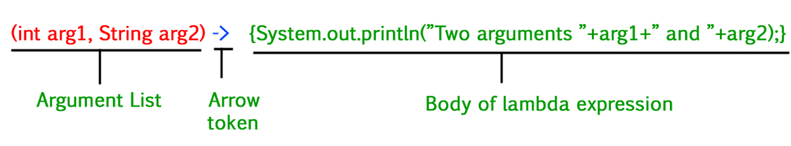

# Lambda Notes
### **What is Lambda Expression in Java**  
- Lambda expression is an **anonymous** function that provides a clear and concise way to represent a method interface.
- It is beneficial in iterating, filtering, and extracting data from a collection.It may or may not have results and parameters.
- Lambda expressions work only with Functional Interfaces (interfaces with a single abstract method).
    - ```java 
        @FunctionalInterface
        interface MyFunctionalInterface {
            void show();
        }
    ```
### **Types of Lambda Expressions** 
- There are three Lambda Expression Parameters are mentioned below:
    - Zero Parameter - `() -> System.out.println("Hello, Lambda!");`
    - Single Parameter - `(x) -> System.out.println(x);`
    - Multiple Parameters - `(x, y) -> x + y;`



### **Additional Points**
- Lambda expression can access **local variables** only if they are **final** or they are **never modified** inside the method.
- Whereas **instance variables** are allowed to be modifed and access inside the lambda.
    - **Example:**  
        ```java        
        class Test {   
            int temp=10;
            public static void main(String[] args) {
                int count = 0;
                mylambda ml=()->{ 
                    int i=o;
                    system.out.println("i"+(++i)); // right  ✅                              
                    system.out.println("temp"+(++temp)); // right  ✅
                    count ++; // Wrong ❌
                }
            }
        }
        ```
- Lambda expression can be send as a parameter if the method is taking a functional interfaces as parameter.
    - **Example:**  ` useLambda.callLambda(()->{System.out.println("Hello Lambda");});`
    - **Lambda as parameter:** [code](https://github.com/MJubairahamed/JavaLearningCodeRepo/blob/main/Code/FunctionalInterface/LamdaExamples/LambdaMultiParamExample.java)
       
- Stream API and Lambda Expressions
    - Commonly used in Streams for concise operations:
    ```java        
       List<String> names = Arrays.asList("Java", "Spring", "Microservices");
       names.stream().filter(name -> name.startsWith("J")).forEach(System.out::println);
    ```