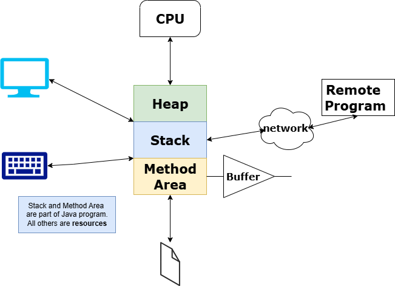
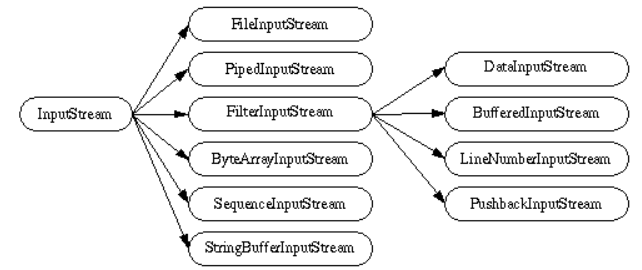
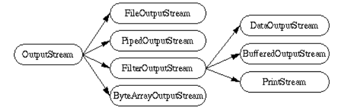
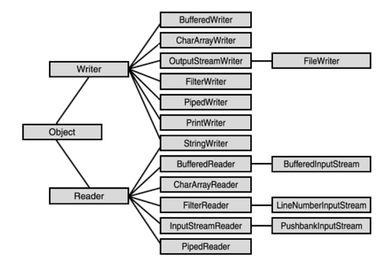

# Streams

## IO (InputOutput)
- Transfering the data in and out from the resources to program. It is called Input Output.

## Stream
- Stream is a **flow of data**. Data may be flow from resouce to program or program to resource. 
    - Just like a water flow from tank to bucket.
- Data will be send in the form of Byte or Chars not a whole chunk. ex: name=John, It will not send as whole string. It will be either send as character like 'J','O','H','N' or in byte. 
- Types of Streams
    - **Byte Stream (1 byte)**
        - InputStream
        - OutputStream
    - **Char Stream (2 byte)**
        - Reader
        - Writer

- What is **buffer**?
    - If the speed of the data send from resource to the Java program environment would not be same, in that case data might get lost. To avoid that, Transfer the data to buffer. Then reciever will get the complete data.
        - Example: While watching videos in mobile buffer initially to load the high quality videos. Because the rate the resource sending the data and rate at which video displayed in video would be different.      

## IO Stream
 

 ## InputStream and OutputStream

- InputStream Classes
 

- OutputStream Classes
 

- **Simple Input and Output Streams**

    - FileInputStream and FileOutputStream
        - Read data from or write data to a file on the native file system.

    - ByteArrayInputStream and ByteArrayOutputStream
        - Read data from or write data to a byte array in memory.

    - StringBufferInputStream
        - Allow programs to read from a StringBuffer as if it were an input stream.
    
    - **ObjectInputStream  and ObjectOutputStream**
        - It is used to read and write objects in a serialized form.They allow Java objects to be saved to a file, transferred over a network, or stored in databases.

- **Filtered Streams**

    - DataInputStream and DataOutputStream
       - Read or write primitive Java data types in a machine-independent format. 
       - Store the properties of the object in the own format. 
       - Student object has rollno(int) and name(string). DataInputStream used to write the object with same datatype. 

    - BufferedInputStream and BufferedOutputStream
       - Buffer data while reading or writing, thereby reducing the number of accesses required on the original data source. Buffered streams are typically more efficient than similar non-buffered streams.    

    - PushbackInputStream
        - An input stream with a one-byte pushback buffer. Sometimes when reading data from a stream it is useful to peek at the next character in the stream in order to decide what to do next. If you peek at a character in the stream, you'll need to put it back so that it can be read again and processed normally.

    - PrintStream
        - An output stream with convenient printing methods.

- **Other**
    - File
        - Represents a file on the native file system. You can create a File object for a file on the native file system and then query the object for information about that file (such as its full pathname).
        
    - RandomAccessFile
        - Represents a random access file.

    - StreamTokenizer
        - Breaks the contents of a stream into tokens. Tokens are the smallest unit recognized by a text-parsing algorithm (such as words, symbols, and so on). A StreamTokenizer object can be used to parse any text file. For example, you could use it to parse a Java source file into variable names operators and so on, or an HTML file into HTML tags, words and such.

## Reader and Writer Classes

 

---
 ## **What is Serialization?**
**Serialization** is the process of converting a Java object into a **byte stream** so that it can be:
- **Saved to a file**
- **Sent over a network**
- **Stored in a database**
- **Recreated later by deserialization**  

#### **Example: Writing an Object to a File** [code](https://github.com/MJubairahamed/JavaLearningCodeRepo/blob/main/Code/Stream/SerializeExample.java) 

#### **Example: Reading the Serialized Object** [code](https://github.com/MJubairahamed/JavaLearningCodeRepo/blob/main/Code/Stream/DeserializeExample.java)

### **Why Do Objects Need to Be Serialized?**
Java objects exist **temporarily in memory (heap)**. To **save, transfer, or retrieve** them later:
1. **Convert them into bytes** (`ObjectOutputStream` - Serialization).
2. **Store or send the bytes** (file, network, etc.).
3. **Convert bytes back into objects** (`ObjectInputStream` - Deserialization).

### **Use Cases of Serialization**
✅ **Saving objects to files** (e.g., caching, configuration storage).  
✅ **Sending objects over networks** (e.g., RMI, WebSockets).  
✅ **Storing objects in databases**.  
✅ **Deep cloning** (object duplication without reference links).  

### **Important Notes**
🚀 **Objects must implement `Serializable`** for serialization.  
⚠ **`transient` keyword** skips fields from serialization (e.g., passwords).  
🔑 **Use `serialVersionUID`** to ensure class version consistency.  

---

-
# IntStream Interview Questions — — ——

### 1. **What is IntStream in Java?.**
   - **Answer**:  
    - **IntStream** is a specialized stream for handling primitive integers (int). It provides a sequence of primitive int values and supports various operations such as filtering, mapping, reduction, and iteration.

### 2. **How do you create an IntStream in Java?**
   - **Answer**:   
    - You can create an IntStream in Java using factory methods like **IntStream.range(int startInclusive, int endExclusive)** or **IntStream.rangeClosed(int startInclusive, int endInclusive)** to create a stream of integers within a specified range, or by converting other data structures like arrays or collections using **Arrays.stream(int[] array)** or **Collection.stream().mapToInt**().

### 3. **What are the terminal operations you can perform on an IntStream?**
  - **Answer**:
    - Common terminal operations include **forEach, sum, average, min, max, count, and reduce**. These operations consume the elements of the stream and produce a result or a side effect.

### 4. **How do you perform mapping operations on an IntStream?**
  - **Answer**:
    - You can perform mapping operations on an IntStream using methods like **mapToInt, mapToLong, and mapToDouble**. These methods transform each element of the stream into another type or value.

### 5. **Explain the usage of filter in IntStream?**
  - **Answer**:
    - The filter method in IntStream is used to **eliminate elements from the stream based on a specified condition**. It takes a predicate as an argument and retains only those elements that satisfy the predicate.

### 6. **How can you filter elements in an IntStream?**
  - **Answer**:
     - You can use the filter method, which takes a predicate. For example:
    ```java
    IntStream.range(1, 10)
            .filter(n -> n % 2 == 0)
            .forEach(System.out::println);
    ```

### 7. **How do you perform reduction operations on an IntStream?**
  - **Answer**:
    - Reduction operations in IntStream are performed using methods like **reduce, sum, average, min, and max**. These operations aggregate the elements of the stream into a single result by applying a binary operator to each element.

- **Sample Program** [code](https://github.com/MJubairahamed/JavaLearningCodeRepo/blob/main/Code/Stream/PrimitiveStreamExample.java)