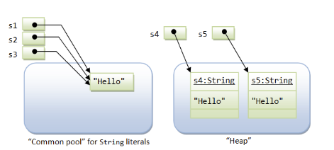

<h1 style="text-align: center;">String</h1>
--

- **Definition**: **String** is a built-in class representing sequences of characters.  
- **JVM** doesn't perform String pool check if you create object using 'new' operator.
      
- **Immutability**: 
- **String Pool Optimization**: Identical string literals refer to the **same object** in the **String Constant Pool** to save memory.  
- **Heap Allocation**: Strings created with `new` are stored in the heap, even if they have the same value as a pooled string.    
- **Reference Variables**: Store memory addresses pointing to string objects.

### **Java String - Key Points**  

1. **Immutability**:  
   - **String** objects are immutable, meaning **cannot be modified** once created.  
   - **Why?**  
     - Improves performance by enabling string pooling.  
     - Saves memory by reusing existing string literals instead of creating new ones.  

2. **String Pool (Interning)**:  
   - Java stores string literals in a **special memory pool** to optimize memory.  
   - If a string with the same content exists, new references point to the existing object.  
   - The `intern()` method explicitly stores a string in the pool if not already present.  

3. **Types of Creating Strings**:  
   - **String Literals**: `String str = "Java";` (stored in the string pool).  
   - **Using `new` Keyword**: `String str = new String("Java");` (creates a new object in heap memory).  

4. **String Comparison**:  
   - Use `.equals()` to compare string **content**.  
   - `==` checks if two references point to the same object, not content.  

5. **String Methods** :  
   - `length()`, `charAt()`, `substring()`, `toLowerCase()`, `toUpperCase()`, `trim()`,  
   - `equals()`, `equalsIgnoreCase()`, `compareTo()`, `split()`, `replace()`.  

6. **Performance & Concatenation**:  
   - Using `+` repeatedly creates multiple string objects due to immutability.  
   - **Use `StringBuilder` or `StringBuffer`** for efficient string manipulation.  

7. **StringBuilder vs. StringBuffer**:  

| **Feature** | **`StringBuilder`** | **`StringBuffer`** |
|-------------|---------------------|--------------------|
| **Thread Safety** | ❌ **Not thread-safe** (no synchronization) | ✅ **Thread-safe** (synchronized methods) |
| **Performance** | ✅ **Faster** (better for single-threaded) | ❌ **Slower** due to synchronization overhead |
| **Use Case** | Best for **single-threaded** scenarios or when thread safety is not a concern | Best for **multi-threaded** scenarios needing synchronization |
| **Mutability** | Mutable | Mutable |
| **Synchronized Methods** | No | Yes |
| **Memory Usage** | Slightly more efficient (no locking) | Slightly more memory due to locking mechanism |
| **Common Methods** | `append()`, `insert()`, `delete()`, `reverse()` | `append()`, `insert()`, `delete()`, `reverse()` |
| **Inheritance** | Extends `AbstractStringBuilder` | Extends `AbstractStringBuilder` |
| **Recommended For** | High-performance string manipulation in **non-concurrent code** | Safer string operations in **concurrent/multi-threaded code** |
| **Example Scenario** | Parsing XML, building log messages | Shared logging or report building in multithreaded environment |

### Example: 
```java
StringBuilder sb = new StringBuilder("Hello");
sb.append(" World");
System.out.println(sb); // Hello World
```

```java
StringBuffer sbf = new StringBuffer("Hello");
sbf.append(" World");
System.out.println(sbf); // Hello World
```
### ✅ Note:
> Use **`StringBuilder`** when **performance is key** and you're working in a **single-threaded** environment.  
> Use **`StringBuffer`** when you need **thread-safe** operations in **multi-threaded** applications.

8. **String and Hashing**:  
   - Strings are widely used as keys in **HashMap** because immutability ensures a **consistent hash code**.  

9. **Character Arrays vs. Strings**:  
   - `String` is **immutable**, while `char[]` is **mutable**.  
   - Using `char[]` for passwords is safer as it can be cleared after use.  

10. **Empty vs. Null Strings**:  
   - `""` (empty string) is a valid `String` object.  
   - `null` means the reference doesn’t point to any object.  

11. **Substring Memory Issue (Fixed in Java 7+)**:  
   - Before Java 7, `substring()` used to **share memory** with the original string, leading to **memory leaks**.  
   - Now, it creates a **new character array** instead.  

---
## **Advanced String concepts**

1. **How does Java handle String encoding and character representation?**  
- Java uses **UTF-16** encoding for `String` internally.  
- Each character is stored as **two bytes** (16 bits).  
- Unicode characters beyond **U+FFFF (Supplementary characters)** are stored as **surrogate pairs** (two `char` values).  

2. **What are the memory implications of creating Strings in Java?**  
- **String literals** are stored in the **string pool** (efficient memory usage).  
- **New String objects (`new String("abc")`) are stored in heap memory** (inefficient if pooling is not used).  
- **Excessive String operations** (e.g., concatenation inside loops) can lead to **heap fragmentation and increased GC pressure**.  
- Use **StringBuilder or StringBuffer** for better memory efficiency.  

3. **How does `split()` in Java behave with regex, and what is a common pitfall?**  
- `split()` uses **regular expressions**, not simple character matching.  
- Common Pitfall: **Using `split(".")` without escaping**, as `"."` is a regex meta-character.  
  ```java
  String[] parts = "www.google.com".split("."); // Incorrect, results in empty array
  String[] correctParts = "www.google.com".split("\\."); // Correct
  ```
- **Performance Impact**: For simple delimiters, use `StringTokenizer` or manual parsing for better performance.  

4. **What is the difference between `concat()` and `+` operator in Java Strings?**  
- Both methods concatenate strings, but:  
  - `+` internally uses `StringBuilder` (except for compile-time constants).  
  - `concat()` only works if the argument is **non-null** (throws `NullPointerException` otherwise).  
  ```java
  String a = "Hello";
  String b = null;
  String result = a.concat(b); // Throws NullPointerException
  ```

5. **What is `StringJoiner` and how does it differ from `String.join()`?**  
- `StringJoiner` (introduced in **Java 8**) allows efficient concatenation with **prefix, suffix, and delimiter**.  
  ```java
  StringJoiner sj = new StringJoiner(", ", "[", "]");
  sj.add("Java").add("Python").add("C++");
  System.out.println(sj); // Output: [Java, Python, C++]
  ```
- `String.join()` is a simpler alternative:  
  ```java
  String result = String.join(", ", "Java", "Python", "C++");
  System.out.println(result); // Output: Java, Python, C++
  ```
- **Difference**:  
  - `StringJoiner` allows **custom prefix & suffix**.  
  - `String.join()` is a **static method**, better for simple use cases.  

6. **How can you efficiently check if a String contains only digits?**  
- Using **Regex** (not optimal for performance-heavy applications):  
  ```java
  boolean isNumeric = str.matches("\\d+");
  ```
- Using **Character.isDigit()** (more efficient):  
  ```java
  boolean isNumeric = str.chars().allMatch(Character::isDigit);
  ```

7. **How can you make a String mutable in Java?**  
- Since `String` is **immutable**, alternatives include:  
  - **`StringBuilder` or `StringBuffer`** for modifying content.  
  - **`char[]`** for manual modification (e.g., security-sensitive data like passwords).  
  ```java
  char[] chars = "Hello".toCharArray();
  chars[0] = 'J'; 
  System.out.println(new String(chars)); // "Jello"
  ```

8. **What are memory leaks related to Strings in Java, and how can you avoid them?**  
- **Long-lived String references in memory (e.g., static collections)** can lead to **memory leaks**.  
- **Using `substring()` (pre-Java 7)** held a reference to the **original large string**, preventing GC.  
  ```java
  String largeString = new String(new char[1000000]); 
  String smallString = largeString.substring(0, 10);
  ```
  - Pre-Java 7: `smallString` still holds a reference to `largeString`, leading to memory wastage.  
  - **Solution**: Explicitly create a new String:  
    ```java
    smallString = new String(smallString);
    ```

9. **How can you optimize searching operations on large Strings?**  
- **Use `indexOf()` or `contains()`** for simple searches.  
- **Use `Pattern` and `Matcher` (Regex) when complex patterns are needed.**  
  ```java
  Pattern pattern = Pattern.compile("Java");
  Matcher matcher = pattern.matcher("I love Java programming.");
  boolean found = matcher.find(); // True
  ```
- **Use Trie Data Structure** for efficient prefix-based search.  

10. **How does `String.format()` work, and when should you use it?**  
- `String.format()` allows formatted string creation similar to `printf()`.  
  ```java
  String result = String.format("Hello, %s! You have %d new messages.", "Alice", 5);
  System.out.println(result); // Output: Hello, Alice! You have 5 new messages.
  ```
- **Use Cases**:  
  - **Dynamic string formatting** (instead of manual concatenation).  
  - **Better readability** for constructing complex messages.  
  - **Localization support** (via `Locale` argument).  

11. **Is it Necessary to Declare Immutable Objects as `final`?**  
- **Not mandatory**, but declaring an immutable class as `final` is a **best practice** to prevent subclassing, which could introduce mutability.  
- **Fields should be `private final`** to ensure they cannot be modified after object creation.  
- If a class is **not declared `final`**, it can still be immutable if all fields are `final` and there are **no setter methods**.  
- Example (Immutable without `final` class):  
  ```java
  class ImmutableExample {
      private final String name;
      public ImmutableExample(String name) { this.name = name; }
      public String getName() { return name; }
  }
  ```


