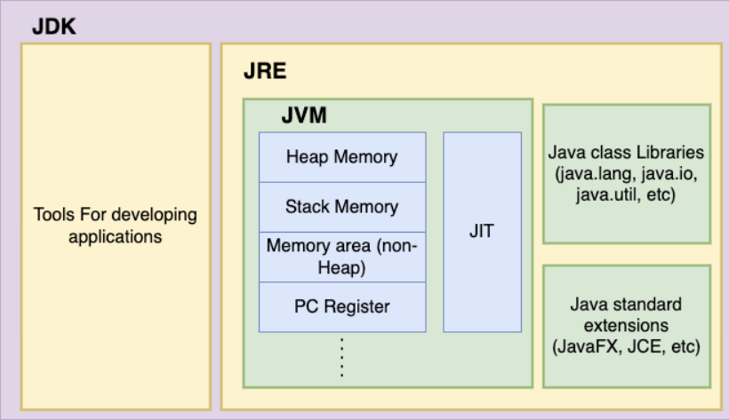
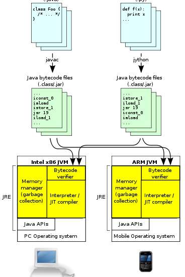

# Basic Java Concepts
-
## What is JDK, JRE and JVM?
### JDK (Java Development Kit)
* Used for developing Java programs (writing and compiling).
* Contains JRE + development tools (compiler, debugger, etc.)  

### JRE (Java Runtime Environment)
* Used for running Java programs (executing the code).
* Contains JVM and libraries needed to run Java applications. 

### JVM (Java Virtual Machine)
* The JVM acts as an interpreter between your Java code and your computer. 

## How JVM Works?
* Compiler converts the ‘C-Language code in to Assembly code. Assembler converts the Assembly code in to Machine code.
* Machine code is the sequences of binary 1 & 0's that the processor understands. 
* Combination of OS and Processor is called Platform.
* Java is a programming language as well as a Platform.
* Compiler compiles the Java code (.java file) in to byte code (.class file). JVM only understands the byte code which is available in RAM of the OS.

#### Components of JVM
* **Class Loader** - Compiled .class files are loaded without linking using Class Loader.
* **Byte Code verifier** – Verify the byte Code. (Reason for why Java is secure).
* **Execution Engine** – Converts the byte code in to machine code.

## What is Class and Object in Java?
* A **class** is like a set of instructions or a blueprint.
* Ex: The class would describe things like the car’s features (color, model, speed) and what it can do (drive, honk). 
* An **object** is the actual thing created from those instructions. 
* An object would be an actual car made using that blueprint, with specific details (e.g., a red sports car that can go 200 km/h) .

### First Java Program
    public class HelloWorld {
        public static void main(String[] args) {
            System.out.println("Hello, World!");
        }
    }

## Difference between interpreters and compilers

| **Feature**              | **Interpreter**                              | **Compiler**                                 |
|--------------------------|----------------------------------------------|----------------------------------------------|
| **How it works**          | Reads and runs the program **one line at a time**. | Reads the whole program and **translates it all at once**. |
| **Speed**                 | **Slower** because it works line by line.    | **Faster** because it runs the entire program at once. |
| **Errors**                | Stops when it finds an error, so you fix them **one by one**. | Shows **all errors** after translating the whole program. |
| **Output**                | No file is created, it just runs the code.   | Creates a **new file** that can be run on any computer. |
| **Examples**              | Python, JavaScript                          | C, C++, Java                                  |

-
### Note: Java uses both a compiler and an interpreter** as part of its execution process. Here's how it works:

1. **Compilation Stage**: When you write Java code, it is first compiled by the **Java compiler (`javac`)**. The compiler translates your source code into an intermediate form called **bytecode**. This bytecode is platform-independent, meaning it can run on any system that has a Java Virtual Machine (JVM).

2. **Interpretation/Execution Stage**: The **JVM** (Java Virtual Machine) then interprets this bytecode. The JVM includes an **interpreter** that reads and executes the bytecode line by line, as well as a **Just-In-Time (JIT) compiler** that can optimize the code by compiling it to native machine code for faster execution.

This two-step process makes Java both a compiled and an interpreted language, providing a good balance of performance, portability, and platform independence.

