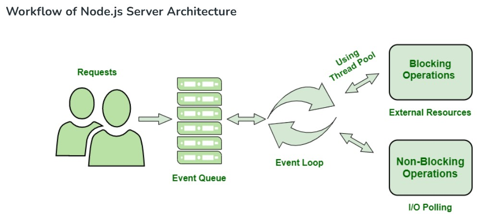

# Node Basics

### What is NodeJS?
   - Node.js is an open-source, a **runtime environment** for executes JavaScript code outside of a web browser.
   - Node.js is not a framework or a programming language but an environment that allows JavaScript code to be run on the server side. 
   - It uses an **event-driven**, **non-blocking I/O model** (allows programs to perform input/output operations without waiting for them to complete before continuing with other tasks.), making it **lightweight** and **efficient for data-intensive real-time applications**.
   - It is used to create **I/O-intensive web applications** such as chat apps, multimedia streaming sites, rest api etc. 
   - It is built on Google Chrome’s V8 JavaScript engine.

## Node.js Server Architecture
### **Node.js Server Architecture:
- ** To manage several concurrent clients, Node.js employs a “Single Threaded Event Loop" design. The JavaScript event-based model and the JavaScript callback mechanism are employed in the Node.js Processing Model.
- It employs two fundamental concepts:
    - Asynchronous model
    - Non-blocking of I/O operations

### Components of the Node.js Architecture
- **Requests:** Depending on the actions that a user needs to perform, the requests to the server can be either blocking (complex) or non-blocking (simple).
- **Node.js Server:** The Node.js server accepts user requests, processes them, and returns results to the users.
- **Event Queue:** The main use of Event Queue is to store the incoming client requests and pass them sequentially to the Event Loop.
- **Thread Pool:** The Thread pool in a Node.js server contains the threads that are available for performing operations required to process requests.
- **Event Loop:** Event Loop receives requests from the Event Queue and sends out the responses to the clients.
External Resources: In order to handle blocking client requests, external resources are used. They can be of any type ( computation, storage, etc).

### Workflow of Node.js Server Architecture

 

### Advantages of Node.js Server Architecture
- There is no need to establish multiple threads because Event Loop processes all requests one at a time, therefore a single thread is sufficient.
- The entire process of serving requests to a Node.js server consumes less memory and server resources since the requests are handled one at a time.

### Disadvantages of Node.js Server Architecture
- **Single-Threaded:** Limited to one thread; can be a bottleneck for CPU-intensive tasks.
- **Callback Hell:** Complex nesting of callbacks can lead to hard-to-maintain code.
- **Performance Bottlenecks:** Not optimal for heavy computational tasks due to non-blocking I/O model.
- **Dependency on Outside Libraries:** Heavy reliance on third-party libraries can impact stability and security.
- **Inconsistent API:** Frequent API changes can lead to backward compatibility issues.
- **Lack of Strong Typing:** JavaScript’s lack of strong typing can lead to runtime errors and bugs.